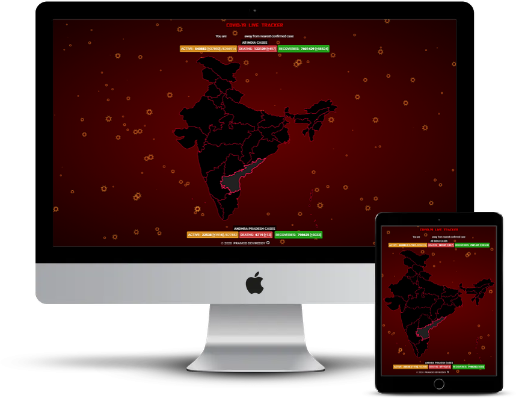

    
    <h2 align="center">COVID-19 Live Tracking & Interactive Dashboard</h2>
    
<a>https://covid19livetrack.herokuapp.com</a>

## Features

-   Real-Time Stats & Tracks Distance from Nearest COVID-19 Confirmed Case
-   Click on any state on the map to get the State's Real-Time Stats
-   Click on the virus to repulse them away. Protect India from the virus 😜
-   Update Interval: 1 minute
-   Responsive for various devices
-   Real-Time Stats Data Source: https://api.covid19india.org/
-   Distance Tracking Source: https://www.coronatracker.in/

\*_Best Viewed in Desktops_

## App Deploys

-   Heroku App: https://covid19livetrack.herokuapp.com
-   Github Pages: https://pramod-devireddy.github.io/covid19/

Made with  and ❤️
